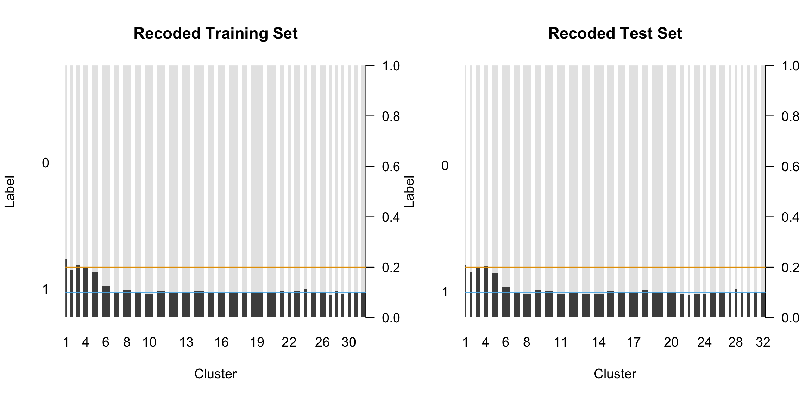
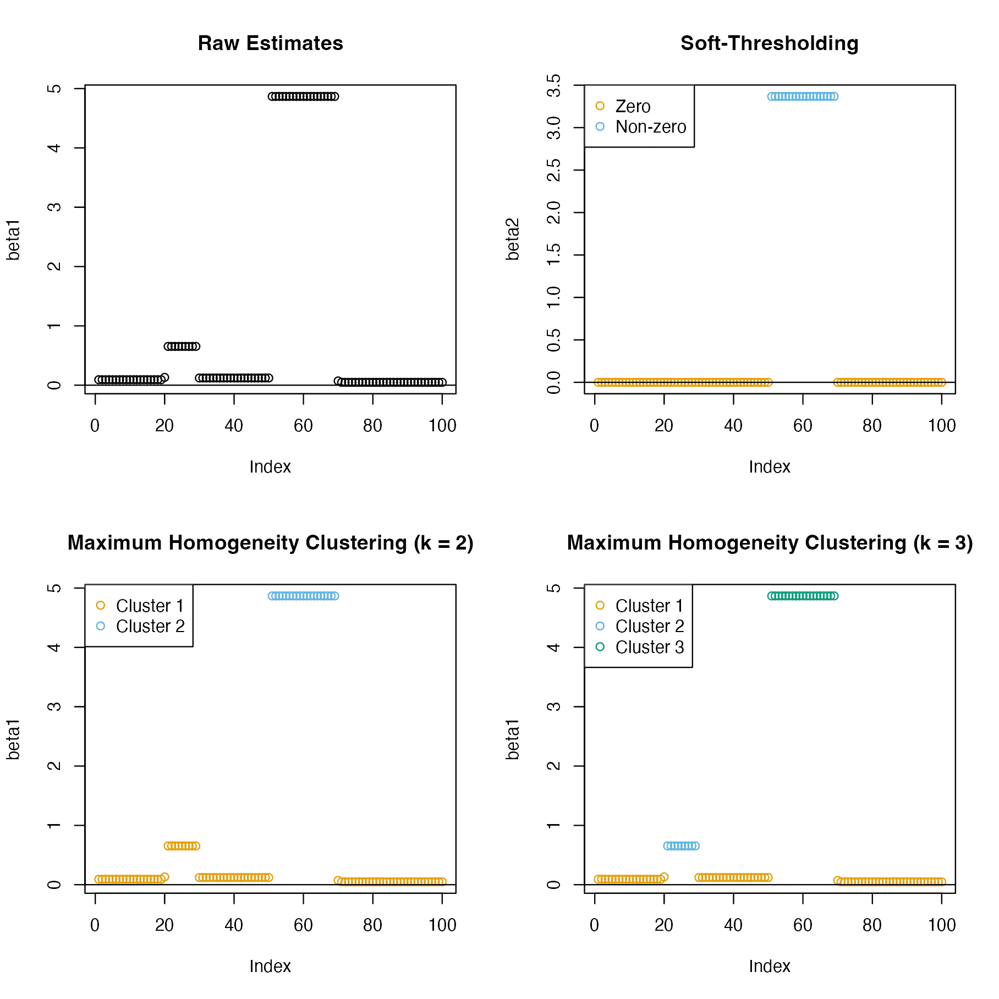
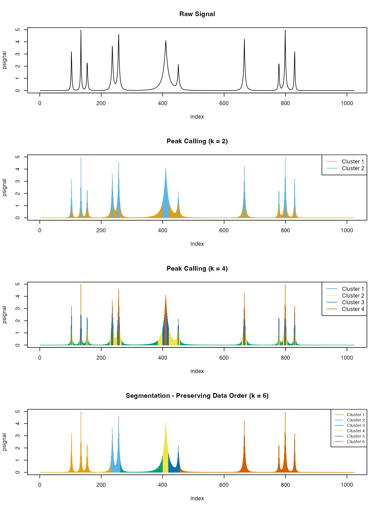

<!-- README.md is generated from README.Rmd. Please edit that file -->

# oneclust 

<!-- badges: start -->

[](https://github.com/nanxstats/oneclust/actions/workflows/R-CMD-check.yaml)
[](https://cran.r-project.org/package=oneclust)
[](https://cran.r-project.org/package=oneclust)
<!-- badges: end -->

Implements the maximum homogeneity clustering algorithm for
one-dimensional data described in W. D. Fisher (1958)
\<[doi:10.1080/01621459.1958.10501479](https://www.tandfonline.com/doi/abs/10.1080/01621459.1958.10501479)\>
via dynamic programming.

Check `vignette("oneclust")` for its applications in feature
engineering, regression modeling, and peak calling.

## Installation

You can install oneclust from CRAN:

``` r
install.packages("oneclust")
```

Or try the development version from GitHub:

``` r
remotes::install_github("nanxstats/oneclust")
```

## Gallery

### Feature engineering for high-cardinality categorical features



### Grouping coefficients in regression models



### Sequential data peak calling and segmentation



## License

oneclust is free and open source software, licensed under GPL-3.
